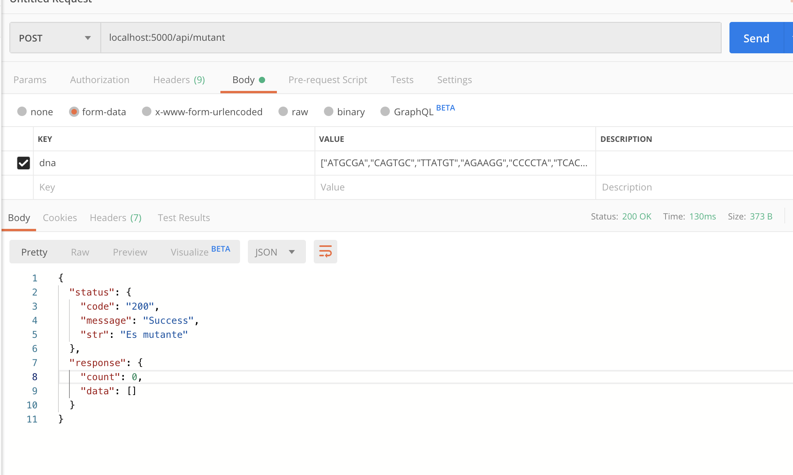

# x-mens
API de detección de mutantes Nivel 3, construida en NodeJS con locomotive.

Requisitos:

.- Tener instalada la versión 8.11.4 de NodeJS
.- BBDD local MySQL o remota.

Instrucciones de uso:

1.- Descargar repositorio.  
2.- Ingresar a la carpeta e instalar los modulos de Node con el comando "npm install" 
3.- Desplegar usando un cliente heroku con el comando "heroku local" o directamente con "node server.js" 

<!-- Pruebas:

1.- Usar un cliente API rest, recomendable Postman. 
2.- Datos:  
   .-URL: localhost:5000/api/mutant 
   .-METODO: POST 
   .- DATA BODY: {
      "dna": "["ATGCGA","CAGTGC","TTATGT","AGAAGG","CCCCTA","TCACTG"]"
   } 
 3.- Imagen de prueba: 
 
  -->
